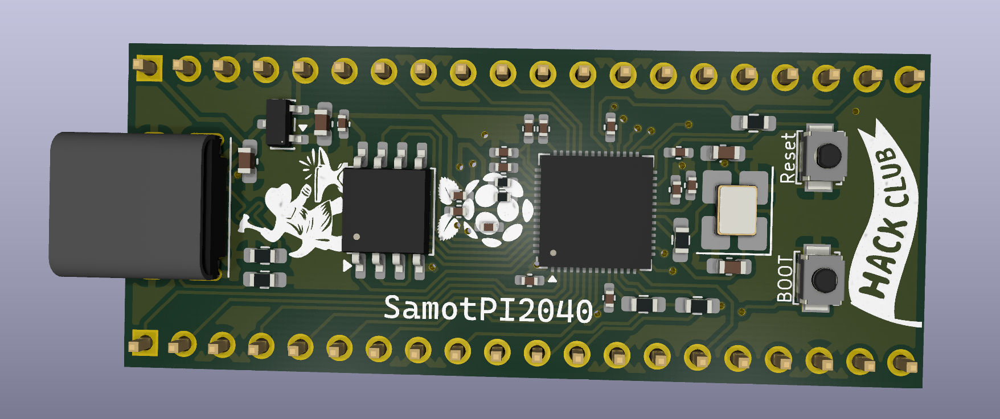
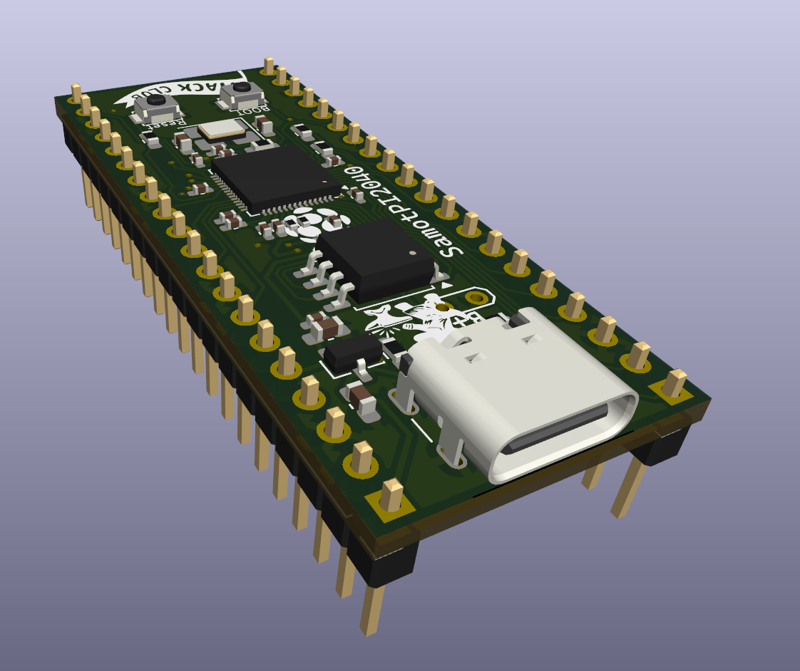
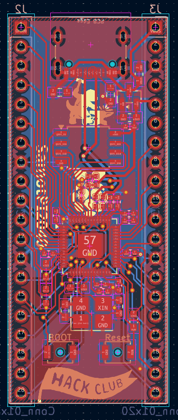
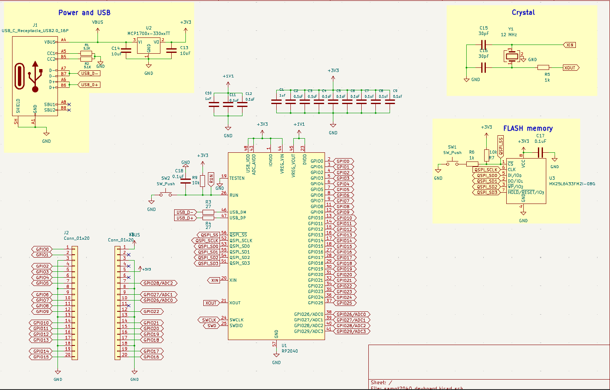
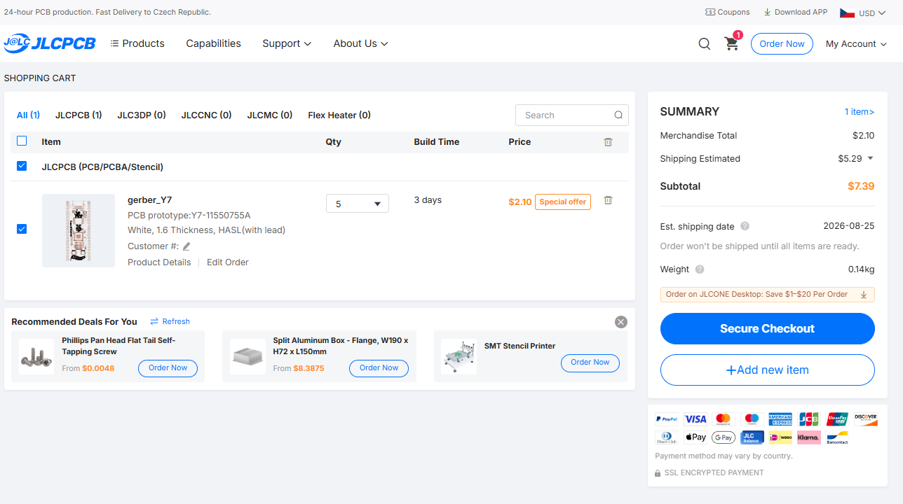
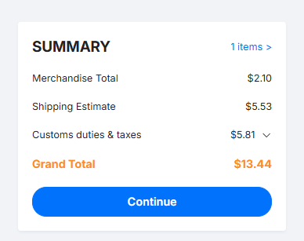

# SamotPi2040 DevBoard

---

## 📌 Project Overview & Purpose

- **What is it?** A standalone development board based on the Raspberry Pi RP2040 dual-core ARM Cortex-M0+ processor.
- **What does it do?** It provides all essential supporting circuitry (power regulation, high-speed crystal oscillator, SPI flash, USB termination, and ESD/pull-down configuration) to run MicroPython, CircuitPython, Arduino, or bare-metal C/C++ Pico SDK code.
- **Why does it exist?** It was created to explore custom PCB design from scratch, master 2-layer routing with fine-pitch QFN and 0402 components, and build a reliable, inexpensive, and customizable devboard for prototyping robotics and embedded electronics.

---

## Why I Made This Project

Because I wanted to design my own RP2040 board with my own design a to be able to say "I made this" with:
1. A modern **USB-C** connector
2. Integrate both **BOOT** and **RESET** switches directly on board to make flashing easy.
3. Provide a full 8MB high-speed SPI Flash storage for large CircuitPython scripts, assets, and datalogging.

---

## Project Gallery

### 3D Render

### 3D Board View

### PCB Layout & Routing

### Schematic

---

##  Hardware Features & Specifications

| Feature | Specification |
| --- | --- |
| **Microcontroller** | Raspberry Pi RP2040 (Dual-core ARM Cortex-M0+ up to 133 MHz, 264 KB on-chip SRAM) |
| **Flash Memory** | 8 MB (64 Mbit) SPI Flash (Macronix MX25L6433FM2I-08G, SOIC-8) |
| **Power Input** | USB-C 5V VBUS input |
| **Voltage Regulation** | Microchip MCP1700T-3302E/TT (3.3V Low-Dropout Regulator, **250mA** output) |
| **Expansion / I/O** | 2x 1x20-pin 2.54mm pitch headers (breadboard compatible) |

---

## 🛠️ Step-by-Step Assembly Guide

> [!IMPORTANT]
> I recommend using HOT airflow station or hot plate for soldering because there are really small components like the main chip or 0402 capacitors/resistors

### Required Tools
- Hot air station / hot plate and soldering iron
- solder flux paste / pen and solder wick
- tweezers
- USB-C data cable

### Assembly Steps

1. **Solder the RP2040 chip:**
   - Apply a thin layer of solder paste to the center thermal pad and other pads.
   - Align first pin of the RP2040 chip using the silkscreen dot marker.
   - Reflow using hot air (~320°C–350°C) or hot plate. Make sure the chip is centered.
2. **Solder the Flash (U3) and voltage Regulator (U2):**
   - Solder the MX25L6433 flash chip (SOIC-8) and the MCP1700 (SOT-23). You can do this with normal 
3. **Solder Passives (Resistors & Capacitors) and Crystal:**
   - Solder the small 0402 capacitors (C1–C12, C17, C18) close to the RP2040 power pins.
   - Solder the 0603 capacitors (C13, C14), crystal load capacitors (C15, C16), and resistors (R1–R7, R9).
   - Then carefully solder the 12 MHz crystal (Y1).
4. **Solder USB-C (J1):**
   - Align the 16-pin USB-C receptacle (GCT USB4085). Solder the through-hole shielding legs for mechanical strength, then use a iron tip with a lot of flux to solder the other pins.
5. **Solder buttons(SW1, SW2):**
   - Solder the swithces for BOOT and RESET.
6. **Double check :**
   - Inspect all solder joidnts under magnification for solder bridges or cold joints (especially on the RP2040 and USB-C).
   - Using a multimeter in continuity/resistance mode, verify that `VBUS` (5V), `3V3`, and `GND` are **not shorted**.
7. **Solder Pin Headers (J2, J3, ):**
   - Insert the 1x20 2.54mm male headers into a solderless breadboard to keep them perpendicular, place the PCB on top, and solder each pin.

---

##  How to Flash Firmware

The RP2040 has a built-in ROM bootloader that makes flashing firmware simple without requiring external programmers:

1. **Enter Bootloader Mode:**
   - Hold the **`BOOT`** button (SW1).
   - Connect the board to computer using a USB-C data cable 
   - Release the `BOOT` button.
3. **Flashing Firmware:**
   - Drag and drop your compiled **`.uf2`** firmware file onto the `RPI-RP2` drive that should appear on PC:
     - **MicroPython:** Download the [Official RP2040 MicroPython UF2](https://micropython.org/download/rp2-pico/).
     - **CircuitPython:** Download the [Adafruit CircuitPython RP2040 UF2](https://circuitpython.org/board/raspberry_pi_pico/).
     - **C/C++ SDK / Arduino:** Build your project using Arduino IDE (with Earle Philhower RP2040 core) or Pico SDK and drag the resulting `.uf2` file.
4. **Execution:**
   - Once the `.uf2` file finishes copying, the board will automatically dismount and execute the program immediately.

---

## BOM

> Import [`quickOrder_TME.csv`](quickOrder_TME.csv) directly to [TME.eu](https://tme.eu) for fast order.

| Qty | Value | Reference | Footprint | Where | Cost (USD) |
|:---:|:---|:---|:---|:---|:---:|
| 1 | **RP2040** | U1 | QFN-56-1EP (7x7mm, 0.4mm pitch) | [TME LINK](https://www.tme.eu/cz/details/sc0914-7/raspberry-pi-vestavene-systemy/raspberry-pi/ic-rp2040-rp2b2-t-r-500-7-reel/) | $1.02 |
| 1 | **MX25L6433FM2I-08G** (8MB Flash) | U3 | SOIC-8 (5.3x5.3mm, 1.27mm pitch) | [TME LINK](https://www.tme.eu/cz/details/mx25l6433fm2i-08g/pameti-flash-seriove/macronix-international/mx25l6433fm2i-08g-tube/) | $2.40 |
| 1 | **MCP1700T-3302E/TT** (3.3V LDO) | U2 | SOT-23 | [TME LINK](https://www.tme.eu/cz/details/mcp1700t-3302e_tt/stabilizatory-napeti-neregulovane-ldo/microchip-technology/) | $0.65 |
| 1 | **12 MHz Crystal** | Y1 | SMD 3225-4Pin (3.2x2.5mm) | [TME LINK](https://www.tme.eu/cz/details/abm8g-12.000mhz-18/resonators-and-generators/abracon/abm8g-12-000mhz-18-d2y-t/) | $0.39 |
| 1 | **USB-C Receptacle 16P** | J1 | GCT USB4085 | [TME LINK](https://www.tme.eu/cz/details/usb4085-gf-a/konektory-usb-a-ieee1394/gct/) | $1.05 |
| 2 | **Tactile Switch SPST** | SW1, SW2 | SMD (Omron B3U-1000P-B) | [TME LINK](https://www.tme.eu/cz/details/b3u-1000pb/mikrospinace-tact/omron-electronic-components/b3u-1000p-b/) | $1.95 |
| 12 | **0.1 µF (100nF) 16V** | C2, C3, C4, C5, C6, C7, C8, C9, C11, C12, C17, C18 | C_0402 (1005 Metric) | [TME LINK](https://www.tme.eu/cz/details/grm155r71c104ka88d/kondenzatory-mlcc-smd/murata/) | $0.17 |
| 2 | **1 µF 25V** | C1, C10 | C_0402 (1005 Metric) | [TME LINK](https://www.tme.eu/cz/details/grm155r61e105ma12d/kondenzatory-mlcc-smd/murata/) | $0.095 |
| 2 | **10 µF 10V** | C13, C14 | C_0603 (1608 Metric) | [TME LINK](https://www.tme.eu/cz/details/lmk107bj106maltd/kondenzatory-mlcc-smd/taiyo-yuden/lmk107-bj106maltd/) | $0.30 |
| 2 | **27 pF 50V** | C15, C16 | C_0603 (1608 Metric) | [TME LINK](https://www.tme.eu/cz/details/cc0603jrnpo9270/kondenzatory-mlcc-smd/yageo/cc0603jrnpo9bn270/) | $0.043 |
| 2 | **27 Ω 1%** | R3, R4 | R_0402 (1005 Metric) | [TME LINK](https://www.tme.eu/cz/details/erj2rkf27r0x/rezistory-smd/panasonic/) | $0.25 |
| 2 | **5.1 kΩ 1%** | R1, R2 | R_0603 (1608 Metric) | [TME LINK](https://www.tme.eu/cz/details/wr06x5101ftl/rezistory-smd/walsin/) | $0.18 |
| 2 | **1 kΩ 1%** | R5, R6 | R_0603 (1608 Metric) | [TME LINK](https://www.tme.eu/cz/details/crcw06031k00fkea/rezistory-smd/vishay/) | $0.015 |
| 2 | **10 kΩ 1%** | R7, R9 | R_0603 (1608 Metric) | [TME LINK](https://www.tme.eu/cz/details/rc0603jr-0710k/rezistory-smd/yageo/rc0603jr-0710kl/) | $0.085 |
| 2 | **Pin Header 1x20 (2.54mm)** | J2, J3 | PinHeader_1x20_P2.54mm_Vertical | [TME LINK](https://www.tme.eu/cz/details/sl8.20z/konektory-hrebinky/fischer-elektronik/10057879/) | $4.5(I dont need these. Already own) |
| 5 | **PCB ** | PCB | 2-layer FR-4 (1.6mm, ENIG/HASL) | [JLCPCB](https://jlcpcb.com) | ~$13.45 |
| - | **Estimated Shipping** | - | - | - | ~$8.21 |
| **Total** | | | | | **~$30.76** |

### JLCPCB Cart:

  
  

